# qiaomu-design · 偏执型设计顾问

**中文** | [English](#english)

> 让 AI 做出"不像 AI 做的"设计：Jobs 式产品直觉 + Rams 式功能纯粹主义，融合五大顶级设计 Skill 的实测精华。
>
> An opinionated design advisor skill for Claude Code: anti-generic aesthetics, engineering-grade delivery, and a visual "style fitting room" — distilled from a controlled experiment across 5 top design skills.

[](LICENSE) [](https://docs.anthropic.com/claude/docs/claude-code) [更新日志](CHANGELOG.md)

**已验证：** 本 skill 的每条核心规则均来自多轮主流设计 Skill 横评实验，并经浏览器实测交互验证。

**完整横评：** [前端设计 Skill 横评实验室](https://designskill.qiaomu.ai/) 展示 8 个主流变体 × 10 个任务的 80 个真实生成页面，qiaomu-design 与 impeccable 均已补齐全部任务。

## 模型建议

强烈建议用 **GLM5.2 / GLM 5.2** 或 **Claude** 模型执行本 skill。近期实测里，Codex 中的 GPT 模型做设计生成效果很不理想：容易保守、空洞、模板化，难以稳定产出有气质的完整页面。追求高质量视觉时，优先切到 GLM5.2 或 Claude。

## 案例

### 视频案例 · 冥想网站

这个冥想网站是 qiaomu-design 生成的完整网页案例，展示了中文排版、克制动效、留白节奏和东方禅意视觉系统。

<a href="docs/assets/cases/qiaomu-design-meditation-site.mp4">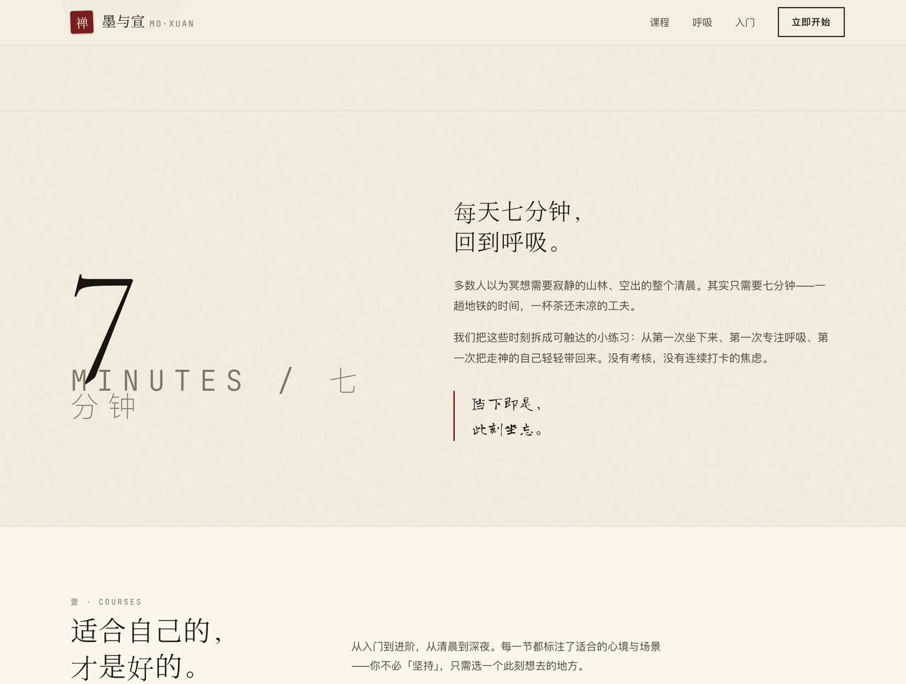</a>

[观看 40 秒 MP4 演示](docs/assets/cases/qiaomu-design-meditation-site.mp4)

### 横评截图

以下 10 张截图来自 qiaomu-design 在横评实验里的真实生成页面。点击截图可打开线上可交互原始文件。

| 落地页 · AI 会议笔记 | 仪表盘 · 电商运营 |
|---|---|
| <a href="https://designskill.qiaomu.ai/pages/qiaomu-design/landing.html">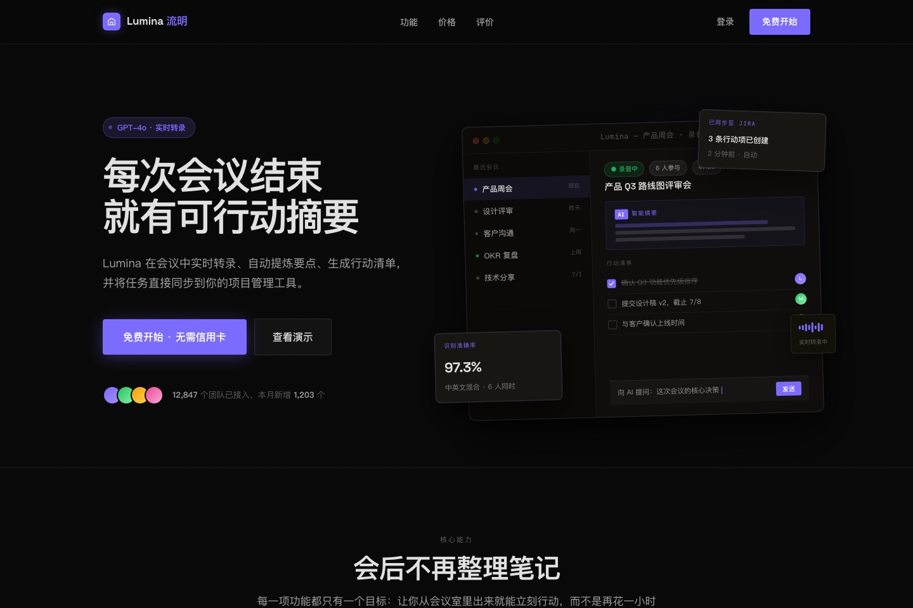</a> | <a href="https://designskill.qiaomu.ai/pages/qiaomu-design/dashboard.html">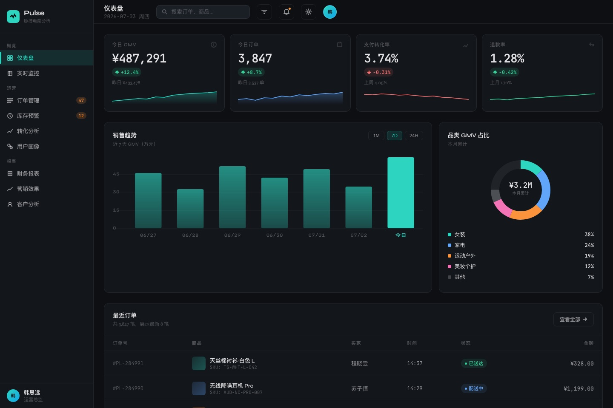</a> |

| 作品集 · 独立设计师 | 交互向导 · 机票预订 |
|---|---|
| <a href="https://designskill.qiaomu.ai/pages/qiaomu-design/portfolio.html">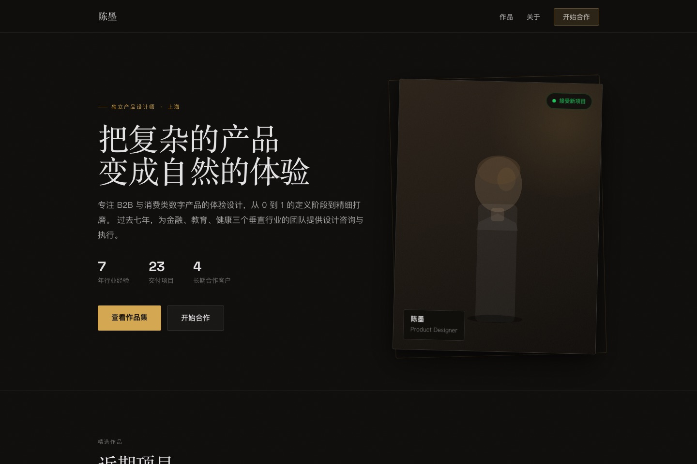</a> | <a href="https://designskill.qiaomu.ai/pages/qiaomu-design/wizard.html">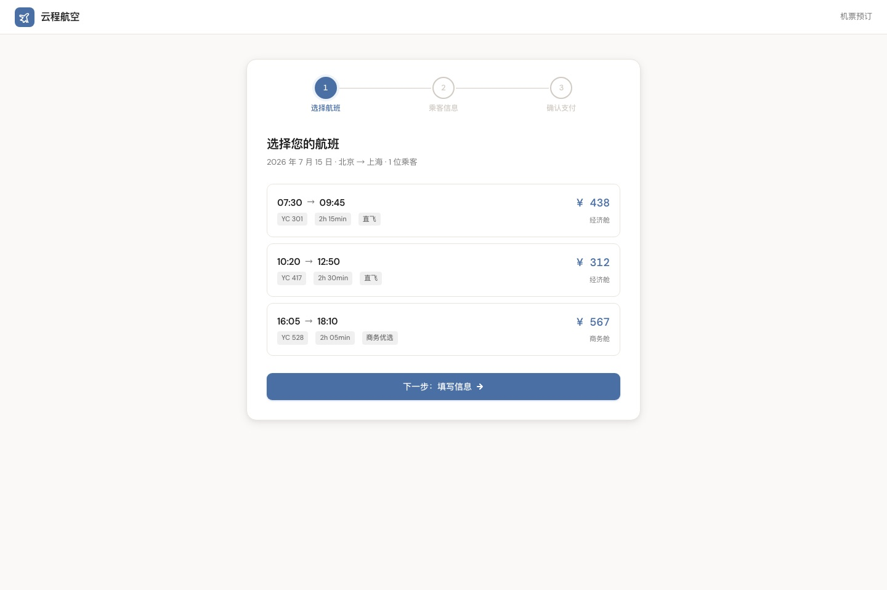</a> |

| 设置中心 · 危险操作组件 | 创意 404 · 星空航行 |
|---|---|
| <a href="https://designskill.qiaomu.ai/pages/qiaomu-design/components.html">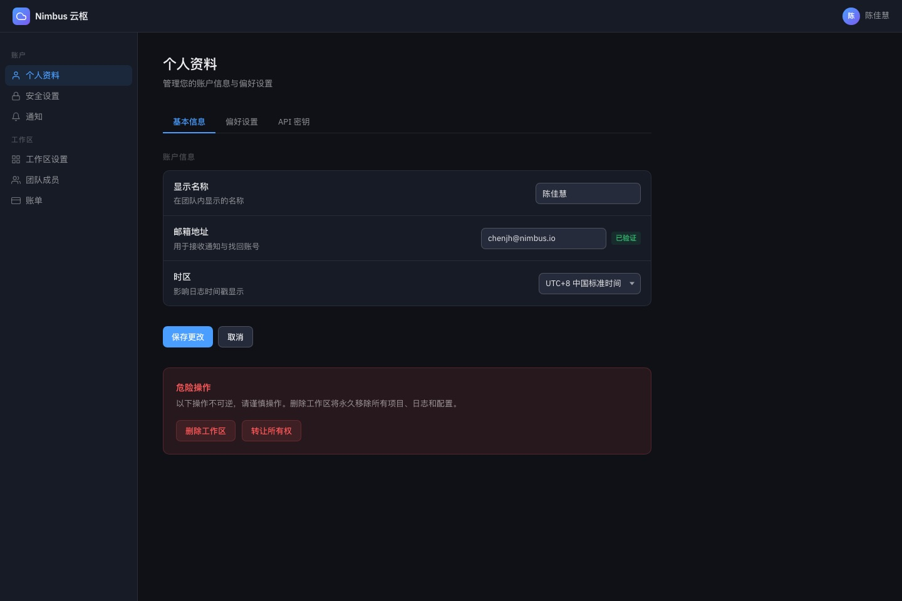</a> | <a href="https://designskill.qiaomu.ai/pages/qiaomu-design/error404.html">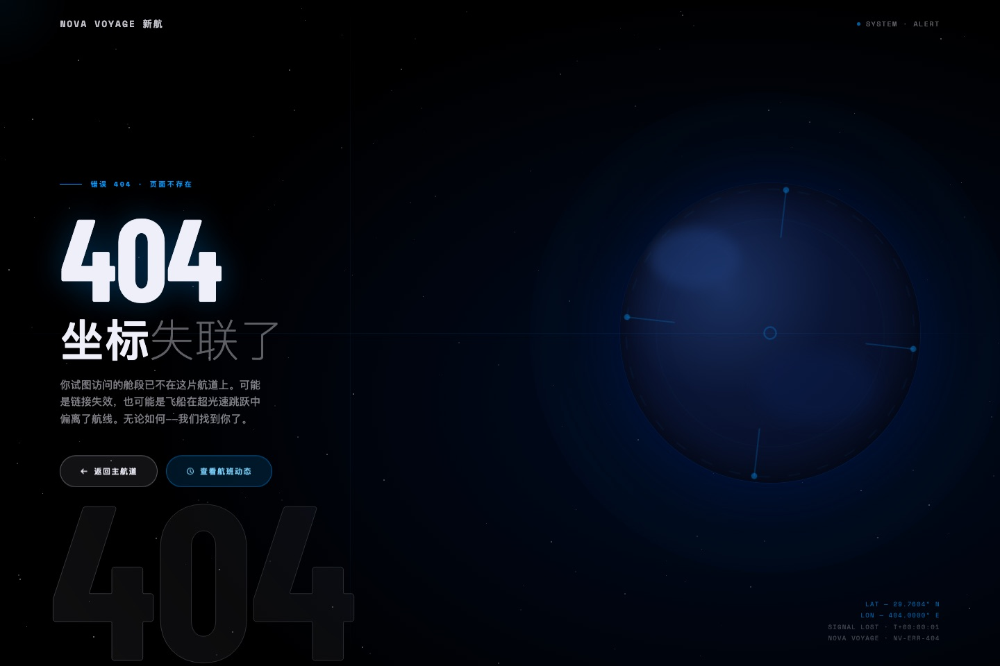</a> |

| 多样性挑战 · 三向播放器 | 电商详情 · 手冲咖啡器 |
|---|---|
| <a href="https://designskill.qiaomu.ai/pages/qiaomu-design/diversity.html">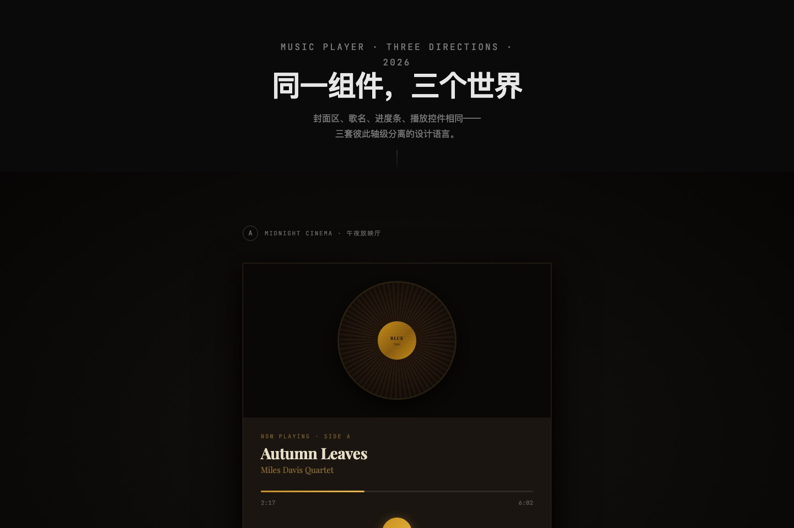</a> | <a href="https://designskill.qiaomu.ai/pages/qiaomu-design/detail.html">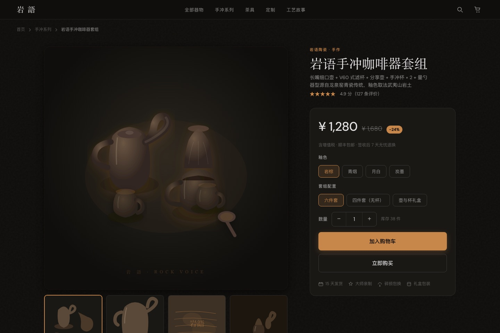</a> |

| 移动端 · 冥想助眠 App | 数据叙事 · 精品咖啡十年 |
|---|---|
| <a href="https://designskill.qiaomu.ai/pages/qiaomu-design/mobile.html">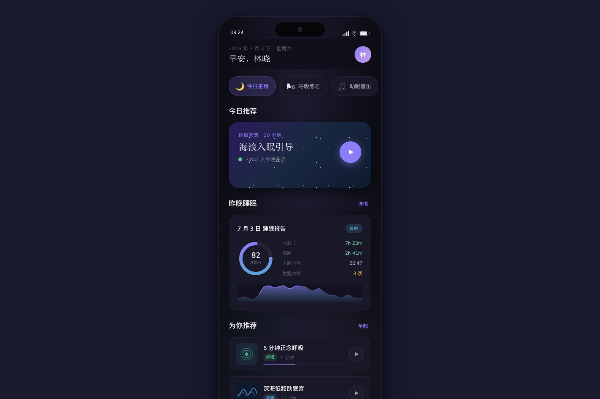</a> | <a href="https://designskill.qiaomu.ai/pages/qiaomu-design/story.html">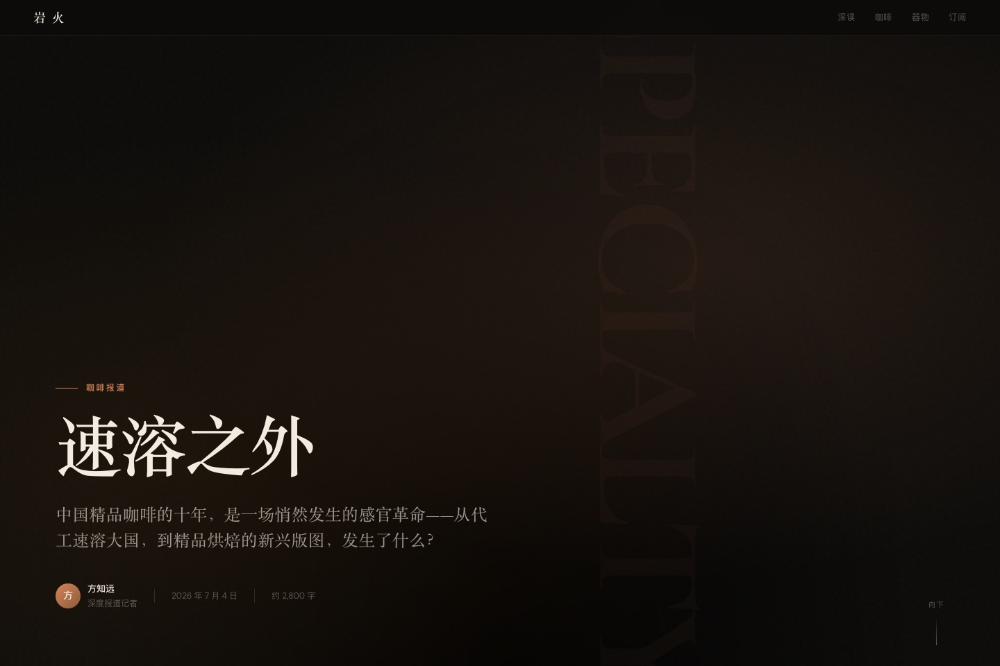</a> |

## 这是什么

一个 Claude Code Agent Skill。安装后，当你说"帮我设计 / 重新设计 / 优化界面"时，它会接管设计流程：先诊断真实需求，再用**可视化风格试衣间**给你 4 个方向实际看着选，确认后按工程验收标准交付——而不是直接吐一个紫渐变居中 Hero 的"AI 味"页面。

## 为什么值得用

大多数 AI 设计的问题不是画不好，而是：默认审美收敛（Inter + 紫渐变 + 三等分卡片）、方向靠文字描述拍脑袋选、交付物过不了工程验收、中文排版直接套英文规则。本 skill 针对这四个问题各给了一套实测过的机制。

## 核心能力

| 能力 | 你得到什么 |
|---|---|
| 风格试衣间 | 4 个互斥方向的真实迷你 mockup，生成在 `design-previews/YYYY-MM-DD-任务名/index.html`，点选/键盘回传 |
| 设计读取 + 三拨盘 | 按任务类型自适应冒险度/动效/密度：功能页收敛、开放命题放开 |
| AI 反套路禁令 | 禁 AI 紫渐变、禁 Inter、禁斜体、禁居中套路、禁 AI 文案词——从源头消灭"AI 味" |
| 中文排版规范 | 系统字体栈优先、装饰中文字体子集化、盘古之白、行高/字重/标点纪律 |
| 动效工艺库 | Emil Kowalski 体系：缓动曲线、分场景时长、按压反馈、stagger、进出不对称 |
| 工程验收清单 | Vercel 规范：a11y、表单、焦点陷阱、危险操作防护，`file:line` 格式审查 |
| 58 站设计系统库 | Stripe/Linear/Apple 等真实网站 DESIGN.md（Google Stitch 格式），可直接"参考 XX 做" |
| 打磨模式 | 已有页面不推倒重来：Audit/Critique/Polish/Animate/Harden/Live 六动作 |
| 交付门禁 | preflight 强制检查清单，任何一条不过就不交付 |
| 自进化机制 | 用户反馈自动抽象成规则写入偏好账本，越用越贴合你 |

## 快速开始

```bash
npx skills add joeseesun/qiaomu-design
```

然后在 Claude Code 里直接说：

```
帮我设计一个产品落地页
```

<details>
<summary>手动安装</summary>

```bash
git clone https://github.com/joeseesun/qiaomu-design.git
cp -r qiaomu-design ~/.claude/skills/qiaomu-design
```

前置条件：已安装 [Claude Code](https://docs.anthropic.com/claude/docs/claude-code)。

</details>

## 使用方式

**触发词**：重新设计 / redesign / 优化界面 / 设计方案 / UI 审查 / 帮我看看设计 / 参考 XX 的设计 / 给我一个设计系统

**典型流程**（三阶段，每阶段等你确认）：

```
你：帮我重新设计博客首页
 ↓ Phase 1  诊断：设计读取 + 三拨盘 + 2-3 个关键问题
 ↓ Phase 2  风格试衣间：生成 design-previews/YYYY-MM-DD-任务名/index.html
            4 个方向实际看着选，点选后回传到当前工作流
 ↓ Phase 3  执行：先立 DESIGN.md 锚 → 写码 → preflight 门禁 → 交付
```

**已有页面要优化**：说"帮我打磨这个页面 / 反 AI 味 / 加动效"，走打磨模式，不推倒重来。

## 工作原理

```
SKILL.md                       人格 + 工作流 + 拨盘 + 反套路禁令 + 自进化协议
references/
  user-preferences.md          用户偏好账本（自进化写入，最高优先级）
  style-preview.md             风格试衣间规范（4 方向 + 60s 自动推进）
  divergence-playbook.md       发散手册（轴级差异检验 + 14 种美学方向）
  motion-craft.md              动效工艺（Emil Kowalski 体系）
  engineering-checklist.md     工程验收（Vercel WIG + 组件行为标准）
  chinese-typography.md        中文排版与配色（W3C clreq / Ant Design / Apple HIG）
  preflight.md                 交付前门禁
  design-systems/{58 站}/      DESIGN.md 设计系统参考库
```

## 实测验证

规则不是拍脑袋写的。改造前先做了一场受控实验：6 个变体（anthropics/frontend-design、vercel/web-design-guidelines、ui-ux-pro-max、taste-skill、emil-design-eng、无 Skill 对照组）× 7 个任务（落地页/仪表盘/作品集/交互向导/组件面板/创意 404/多样性挑战）= 42 个页面，横评视觉个性、工程规范、动效工艺、交互完成度、组件合理性、创造性、多样性七个维度。

后续复测扩展为 [8 个变体 × 10 个任务的公开横评](https://designskill.qiaomu.ai/)，覆盖电商详情、移动端与数据叙事等新场景。每个维度胜者的核心机制被移植进本 skill，来源在 SKILL.md「血统说明」逐条可查。

## 限制与边界

- 这是 Claude Code 的 Agent Skill，不是独立软件；效果依赖模型能力
- 风格试衣间默认生成浅层任务目录：`design-previews/YYYY-MM-DD-任务名/index.html`；
  当前不在项目中时退到桌面目录；用户可以指定输出目录
- 点选回传依赖本地预览服务；服务失败时降级为打开 HTML 文件并在对话中回复选择
- 本 skill 只做设计，不会默认给生成页面注入打赏、公众号、GitHub/X 浮条或乔木个人 Profile；
  对外页面如需署名，建议只放低干扰页脚 `Powered by 向阳乔木` 链接到 `https://qiaomu.ai/`
- 58 站 DESIGN.md 库来自公开网站的设计系统提炼，用于风格参考，不代表对应公司背书
- 装饰性中文字体默认禁用（体积 5-20MB），只在创意标题场景子集化加载——这是特性不是缺陷

## 来源与致谢

MIT License。融合机制来源（详见 SKILL.md 血统说明）：[anthropics/skills](https://github.com/anthropics/skills) · [vercel-labs/web-interface-guidelines](https://github.com/vercel-labs/web-interface-guidelines) · [Leonxlnx/taste-skill](https://github.com/Leonxlnx/taste-skill) · [emilkowalski/skills](https://github.com/emilkowalski/skills) · [nextlevelbuilder/ui-ux-pro-max-skill](https://github.com/nextlevelbuilder/ui-ux-pro-max-skill) · [pbakaus/impeccable](https://github.com/pbakaus/impeccable) · [arvindrk/extract-design-system](https://github.com/arvindrk/extract-design-system) · [mattpocock/skills](https://github.com/mattpocock/skills) · DESIGN.md 库基于 [VoltAgent/awesome-design-md](https://github.com/VoltAgent/awesome-design-md)（Google Stitch 格式）

## 版权

MIT License。Copyright (c) 向阳乔木。

项目主页：[qiaomu.ai](https://qiaomu.ai/) · GitHub：[@joeseesun](https://github.com/joeseesun)

---

<a name="english"></a>

# English

**qiaomu-design** is a Claude Code Agent Skill that makes AI-generated interfaces stop looking AI-generated. It fuses the experimentally-validated strengths of five top design skills (Anthropic frontend-design, Vercel web-interface-guidelines, taste-skill, Emil Kowalski's design engineering, ui-ux-pro-max) into one opinionated design advisor.

## Install

```bash
npx skills add joeseesun/qiaomu-design
```

Then just ask Claude Code: `redesign my landing page`.

## What you get

- **Recommended models**: use GLM 5.2 or Claude for this skill. In recent runs, GPT models inside Codex produced poor design results: too conservative, sparse, and template-like for high-quality visual work.
- **Style fitting room**: 4 mutually-divergent direction mockups (real fonts/colors/layout) in `design-previews/YYYY-MM-DD-task/index.html`. Pick by click or keys; the local preview server reports the selection back to the current workflow.
- **Design read + three dials**: VARIANCE / MOTION / DENSITY auto-tuned per task type — restrained on functional UI, bold on open creative briefs.
- **Anti-slop bans**: no AI-purple gradients, no Inter, no italics, no centered-hero clichés, no "revolutionary/seamless" copy.
- **Chinese typography rules**: system font stack first, subset decorative CJK webfonts (5-20 MB otherwise), CJK spacing/punctuation/line-height discipline.
- **Motion craft** (Emil Kowalski system) and **engineering checklist** (Vercel WIG): easing/durations/stagger, a11y, focus traps, destructive-action guards.
- **58 real-site DESIGN.md library** (Stripe, Linear, Apple…, Google Stitch format) for "make it like X" requests.
- **Polish mode** for existing pages (Audit/Critique/Polish/Animate/Harden/Live) — no rewrites from scratch.
- **Pre-flight gate**: a hard checklist; nothing ships if any item fails.
- **Self-evolution**: your feedback gets abstracted into a preferences ledger the skill reads before every task.

## Verified

Every core rule traces back to controlled design-skill comparisons. The first run covered 6 variants × 7 tasks × 42 generated pages; the public follow-up expands to [8 variants × 10 tasks × 80 generated pages](https://designskill.qiaomu.ai/). The qiaomu-design screenshots above link to the live interactive case pages. The meditation website video case is available at [`docs/assets/cases/qiaomu-design-meditation-site.mp4`](docs/assets/cases/qiaomu-design-meditation-site.mp4). Provenance is documented per-module in SKILL.md.

## Limits

Requires Claude Code. The fitting room is a local HTML preview served by a tiny local callback server; if the server cannot start, it falls back to opening the HTML file and asking the user to reply with the selected direction. qiaomu-design does not inject Qiaomu profile widgets into generated pages by default. The DESIGN.md library is distilled from public sites for reference, not endorsement.

MIT © 向阳乔木 · [qiaomu.ai](https://qiaomu.ai/) · [@joeseesun](https://github.com/joeseesun)
